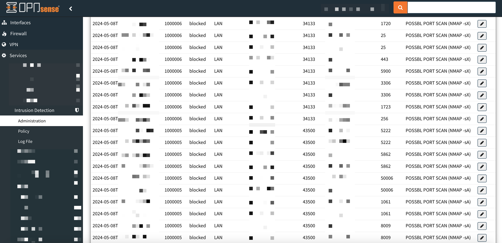

# OPNsense's Suricata IDS/IPS NMAP Detection Rules
### UPDATED: VERSION 2.1 NOW DETECTS EVEN MORE NMAP SCAN TYPES: -sS, -sT, sA, -sX, -f and -sU
#### (Latest update: May 26th 2024 by Aleksi Bovellan)

Because there weren't many working detection alert rules against different types of NMAP port scans in OPNSense's Suricata IDS/IPS, or even in Suricata's ET Telemetry Pro ruleset (which can be activated for free at: https://shop.opnsense.com/product/etpro-telemetry/), especially against slower NMAP scan speeds like T1-T3, I wrote a bundle of my own Suricata detection rules to detect and log as many as possible between scan speeds of T1-T5.

These rules have been tested in a SoHo / home environment without problems. Latest versions tested: OPNsense 24.1.6 and Suricata 7.0.4.

## INCLUDED IN VERSION 2.1

Detection rules against the following commands:

- nmap -sS (between speeds T1-T5)
- nmap -sT (between speeds T2-T5)
- nmap -sA (between speeds T2-T5)
- nmap -sX (between speeds T1-T5)
- nmap -f (between speeds T1-T5)
- nmap -sU (between speeds T1-T5)
- Any usage of destination port 4444 (the most common shell and default MetaSploit port)

## GENERAL

These detection rules work by looking for specific NMAP packet window sizes, flags, port numbers, and known NMAP timing intervals.

The readability in Suricata's detection log have now also been improved for these rules, so it's more easy to instantly see the occured NMAP scan type. (See screenshot).

## USAGE (EASY!)

IMPORTANT: If a previous customized "local.rules" file exists in your Suricata (/usr/local/etc/suricata/rules/local.rules), check for duplicate rule "sid" numbers in the existing one and this one, and modify them as you wish, so that there will be no duplicate rule numbers after this one.

- Save this "local.rules" file - or copy all rules in it - into Suricata's custom rule file -> /usr/local/etc/suricata/rules/local.rules
- Just in case, copy that edited file also over the OPNsense's automatically created one at -> /usr/local/etc/suricata/opnsense.rules/local.rules
- Reload Suricata rules, for example from OPNsense's web GUI's using the sidebar: "SERVICES" -> "INTRUSION DETECTION" -> "ADMINISTRATION" -> "RULES" tab -> click the "Apply" button in the bottom of the page
- OPTIONAL: If you want, you can reload the whole Suricata service too just in case

## KNOWN ISSUES

- These rules do not react to the slowest NMAP speed of T0, which is slower than death by the way, or to "sniping", as in scanning just one or a few custom ports using slower scan settings.
- These rules might also detect other port scanners than NMAP, which happen to use the same or very similar kind of packets.
- After loading these rules, expect to see alerts triggered from WAN interface as the result of everyday scanning and probing, legal and illegal. Use "whois IP" and IP tracing websites to find out more about those scanners. (Many times they hide behind some VPNs or cloud servers, though)
- These rules may very seldom react to some legit self-made connection attempts, which just happen to resemble NMAP packets, and/or are sent in a too rapid rate to be ignored safely.
- Sometimes by lucky accident, your device chooses its ephemeral source port to be port number 4444, which leads to the destination service responding to connect back to that port number as its destination, and that connection might get flagged as "possible shell metasploit" connection - which it is not. For that reason, some of the most common ports have been excluded from that rule. Just something to be aware of.
- Some of these new (version 2.1) NMAP detection rules concerning more regular types of network traffic, like the SYN-ACK 3-WAY scan (-sT) and ACK scan (-sA), had to be throttled back a bit, up to T2, to avoid unnecessary false alarms from legit traffic. And even after that, some of the most common ports still took hits during stress-testing, so a few of those most common ports just had to be excluded all together to make the rules work in any sensible way, especially in a busier Active Directory environment.
- Some Apple iPhone models using VPN software might cause occasional false alarms, "POSSBL SCAN FRAG (NMAP -f)", maybe because of how the VPN connection fragments or packages its data in some specific and rapid enough manner to cause alerts, to the router's Suricata. Especially when changing VPN servers, which usually involves doing some sort of geographic lookups in a rapid time.

## CROWDSEC COMPATIBILITY

If you are running both OPNSense/Suricata and CrowdSec plugin, CrowdSec automatically bans IP addresses which are collected from global threat intelligence sources, but it also bans IP addresses which are detected running port scans with scan speeds down to T2, but not down to T0-T1. Of course you can always whitelist your own attacking IP address in CrowdSec (config file at: /usr/local/etc/crowdsec/parsers/s02-enrich/mywhitelists.yaml) for testing or permanent purposes, or otherwise you might get IP-banned from your own router by CrowdSec while testing different NMAP scans. CrowdSec ignores fragmented NMAP scans though. For more information check: https://docs.crowdsec.net/docs/next/whitelist/format/#whitelist-configuration-example
